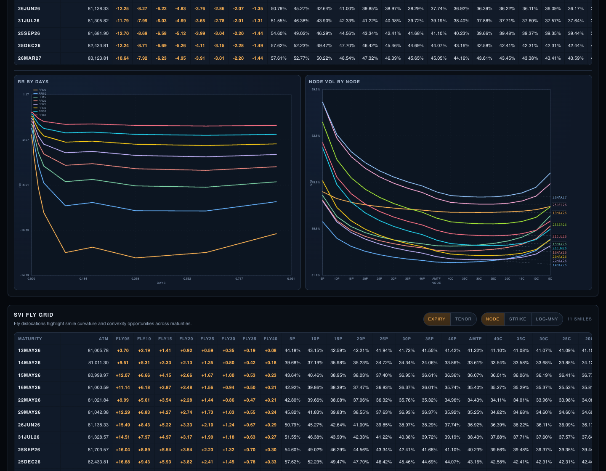
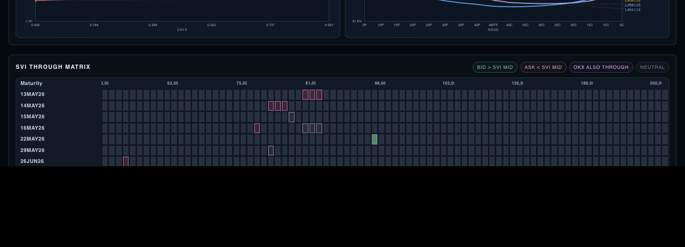
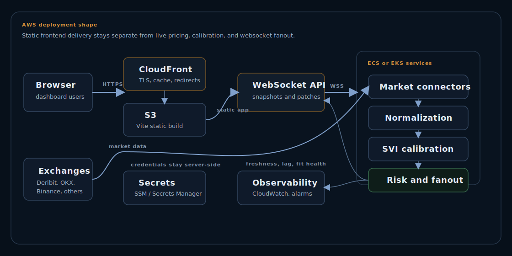
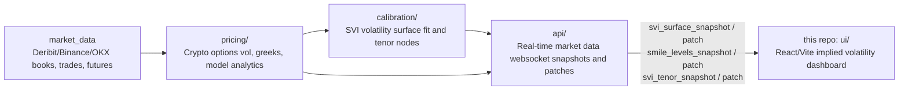

# Crypto Options SVI Volatility Surface Dashboard

Vol Surface is a real-time crypto options dashboard for monitoring an SVI volatility surface inside a broader options pricing and calibration system. It consumes websocket snapshots and patches from a pricing-engine API, then visualises fitted SVI volatility surface slices, implied volatility term structure, options smile charts, risk reversal and fly nodes, tenor slices, quote-vs-fit dislocations, and fit diagnostics.

Live dashboard: [dashboard.derivasys.com](https://dashboard.derivasys.com)

The dashboard is designed for real-time market data from Deribit, Binance, OKX, and similar crypto options venues. Websocket ingestion keeps the fitted SVI volatility surface, implied volatility smiles, risk reversal term structure, and quote-vs-fit dislocation panels current as market data changes.

This repository contains the `ui` layer only. Backend pricing, calibration, market-data normalisation, and websocket broadcasting services are expected to live in the wider engine stack.

Although demonstrated on crypto options and crypto implied volatility workflows, the framework is designed around general pricing-system problems: constrained calibration, real-time market data normalisation, curve/surface construction, risk generation, and trader-facing visualisation. These concepts transfer directly to rates curves, swaption surfaces, credit curves, and fixed income analytics.

## Repository Metadata

Description: Real-time crypto options volatility surface analytics platform with live SVI fitting and multi-exchange market data ingestion.

Topics: `svi`, `volatility-surface`, `crypto-options`, `deribit`, `implied-volatility`, `options-analytics`, `quant-finance`, `websockets`, `BTC`

Underlyings: designed for `BTC`, `ETH`, and altcoin crypto options surfaces published by the websocket API as the active feed.

Tech stack: React, TypeScript, Vite, Canvas charts, Recharts, Framer Motion, Lucide React, CSS, WebSocket APIs, nginx, Docker, S3/CloudFront-compatible static deployment.

## Documentation

- [Architecture](docs/architecture.md): system flow from Deribit/Binance/OKX real-time market data through websocket ingestion into the SVI volatility surface dashboard.
- [Scaling](docs/scaling.md): browser, API, and websocket scaling notes for high-frequency crypto options implied volatility updates.
- [SVI Fitting](docs/svi-fitting.md): SVI volatility surface concepts, options smile inputs, risk reversal nodes, and fit-quality diagnostics.

## Demo Scope

The crypto options dashboard is designed to run against a live websocket API that publishes real-time market data and calibrated SVI volatility surface updates. Without that API it can still be built, linted, and previewed, but the implied volatility, options smile, and market-data panels will not populate.

Recommended screenshots before sharing publicly:

- Surface monitor: SVI volatility surface, implied volatility term structure, and fit diagnostics.
- Smile matrix: per-expiry options smile bid/ask/trade implied volatility with Deribit, Binance, OKX, or other venue overlays.
- Risk grids: risk reversal and fly nodes, tenor mode, and quote-through-fit heatmap.

## Screenshots

Screenshots are stored in `public/screenshots/` so they work in the deployed information pages and in this README.





## What It Does

- Displays a live fitted SVI volatility surface and variance surface from the pricing engine.
- Shows per-expiry options smile charts with Deribit, Binance, OKX, or other venue bid, ask, and last-trade implied volatility points.
- Tracks risk reversal nodes, fly nodes, tenor rows, and risk reversal/fly term structures.
- Highlights quotes through the fitted SVI implied volatility mid in the SVI-through matrix.
- Uses websocket ingestion to merge real-time market data snapshots and patches without replacing the whole crypto options surface on every tick.
- Shows fit metrics such as current fit, last fit, elapsed fit time, feed state, and SVI push time.
- Provides runtime diagnostics for websocket queue depth, dropped messages, render timing, and crash logs.
- Supports first-visit data-quality/GDPR disclosure for externally shared deployments.
- Deploys as a static Vite build, suitable for S3/CloudFront or another HTTPS-capable static host.

## MVP And AWS Scaling Path

The current MVP keeps the browser layer deliberately simple. This repository builds a static React/Vite dashboard, connects to one websocket API, receives the current active BTC, ETH, or altcoin options surface, and merges snapshots and patches in the browser. The pricing engine remains responsible for exchange ingestion, quote normalization, SVI calibration, risk reversal/fly construction, and fit diagnostics.

In MVP form, the deployment shape is:

- `S3 + CloudFront`: serve the static dashboard over HTTPS.
- `Websocket API`: publish compact surface snapshots and patches over WSS.
- `Pricing/calibration services`: run behind the API boundary, away from the browser.
- `CloudWatch/logging`: track feed freshness, fit latency, websocket reconnects, queue depth, and dropped messages.

As usage and market-data volume grow, the backend can scale without changing the UI contract. ECS is the pragmatic first AWS step for separate ingestion, calibration, and websocket services. EKS becomes more useful when the system needs independently scaling stream processors, calibration workers, websocket gateways, health checks, and controlled rollouts.

The next evolution is Kafka plus Kubernetes: exchange connectors publish replayable market-data events into Kafka topics, calibration workers consume normalized quote streams, and websocket gateways fan out compact dashboard-ready patches. The browser still receives the same snapshots and patches; Kafka and K8s improve resilience, replay, and operational scaling behind that boundary.



More detail:

- [AWS Architecture](aws-architecture/index.html): how the static frontend, websocket API, runtime services, secrets, and observability fit together.
- [Kafka/Kubernetes Roadmap](kafka-kubernetes-roadmap/index.html): how the backend can evolve toward replayable market-data streams and independently scalable workers.

## Architecture



Expected wider repo layout:

```text
pricing/        Crypto options pricing models, greeks, implied volatility analytics
calibration/    SVI volatility surface calibration, risk reversal/fly node construction, tenor interpolation
market_data/    Deribit/Binance/OKX websocket clients, book/trade normalisation
api/            Websocket API and real-time market data snapshot/patch broadcaster
ui/             This React/Vite implied volatility dashboard
```

Boundary of this repository:

```text
Included:     React crypto options dashboard, chart rendering, websocket ingestion, static build/deploy config
Not included: Exchange connectors, pricing models, SVI volatility surface calibration jobs, persisted market data, API service
```

Current repo layout:

```text
src/App.tsx                         Main dashboard layout and panels
src/App.css                         Dashboard styling and responsive layout
src/hooks/useSviFeed.ts             Websocket ingestion and state merging
src/lib/svi-charting.ts             Chart data builders and formatting helpers
src/lib/svi-types.ts                Stream and chart TypeScript types
src/components/CanvasCharts.tsx     Canvas-based smile and variance charts
src/components/Surface3DCanvas.tsx  3D surface renderer
src/components/AppErrorBoundary.tsx Runtime crash boundary
docs/architecture.md                Architecture and data-flow notes
docs/scaling.md                     Scaling and websocket ingestion notes
docs/svi-fitting.md                 SVI fitting and implied volatility notes
public/derivasys.svg                Browser favicon
scripts/export-dist.sh              Copies build output into another repo
Dockerfile                          Production frontend image
nginx.conf                          Static serving and websocket proxy
docker-compose.yml                  Frontend plus API local deployment
```

## Technical Design Notes

- The websocket ingestion layer treats real-time market data payloads as snapshots or patches and merges them by expiry/tenor/strike rather than replacing whole SVI volatility surfaces on every tick.
- Canvas rendering is used for dense, fast-moving options smile, implied volatility, and SVI volatility surface charts to avoid excessive DOM churn.
- Bid/ask/last-trade points are animated and aged client-side so transient market updates do not appear as hard flicker.
- Fit metrics, risk reversal diagnostics, queue depth, dropped-message counts, render timings, and crash logs are exposed through a debug mode for operational diagnosis.
- Configuration is environment-driven via `VITE_SVI_WS_URL`; production deployments should use `wss://...` or a same-origin HTTPS websocket proxy.

## Runtime Data Contract

The UI expects the crypto options API to stream JSON websocket messages for real-time market data, implied volatility points, options smile updates, and fitted SVI volatility surface state. Supported message families include:

- `svi_surface_snapshot`
- `svi_surface_patch`
- `smile_levels_snapshot`
- `smile_levels_patch`
- `smile_levels_add`
- `smile_levels_remove`
- `svi_tenor_snapshot`
- `svi_tenor_patch`
- `surface_fit_status`
- `svi_fly_patch`

The preferred surface format is schema version `1`, with per-expiry options smiles, `x_axis`, `var`, `vol`, implied volatility points, risk reversal nodes, fly nodes, and tenor rows.

## Requirements

- Node `>=20.19.0`
- npm
- A running websocket API for the pricing engine

With `nvm`:

```bash
nvm use
```

## Run Locally

Install dependencies:

```bash
npm install
```

Start the dev server:

```bash
npm run dev
```

By default the UI connects to:

```text
ws://localhost:8765 on localhost
wss://api.derivasys.com on HTTPS deployments
```

Point it at another API:

```bash
VITE_SVI_WS_URL=api.derivasys.com npm run dev
```

`VITE_SVI_WS_URL` accepts `ws://...`, `wss://...`, `http(s)://...`, same-origin paths such as `/ws`, or a bare host such as `api.derivasys.com`. Bare hosts automatically use `ws://` on HTTP pages and `wss://` on HTTPS pages.

## Build And Preview

```bash
npm run lint
npm run build
npm run preview
```

The production build is written to:

```text
dist/
```

## Docker

Docker is provided for local/containerised development. The current production-style deployment is expected to be a static build served from S3/CloudFront or another HTTPS static host.

Run the frontend and API container together locally:

```bash
docker compose up --build
```

The frontend is served at:

```text
http://localhost:8080
```

The included nginx config proxies:

```text
/ws -> api:8765
```

By default compose expects:

```text
svi-api:latest
```

Override the API image:

```bash
SVI_API_IMAGE=your-registry/your-api:tag docker compose up --build
```

Build the frontend against a direct websocket URL:

```bash
VITE_SVI_WS_URL=api.derivasys.com docker compose up --build frontend
```

## Static Deployment

For S3, CloudFront, nginx, or any static host:

```bash
VITE_SVI_WS_URL=api.derivasys.com npm run build
```

Upload the contents of `dist/`.

Static hosting only serves the UI. The pricing API must still be reachable from the browser.

For an S3-hosted deployment:

- Serve the bucket through CloudFront or another HTTPS-capable CDN.
- Build the UI with `VITE_SVI_WS_URL=api.derivasys.com`, or omit it and let non-local deployments default to `api.derivasys.com`.
- If the page is loaded over HTTPS, the app will use `wss://api.derivasys.com`. If it is loaded over HTTP, it will use `ws://api.derivasys.com`.
- If the API is only exposed as plain `ws://...`, put TLS in front of it first before serving the frontend over HTTPS. A page loaded over `https://...` cannot connect to an insecure websocket endpoint.
- Common API TLS options are an AWS Application Load Balancer with an ACM certificate, CloudFront in front of an HTTP websocket origin, or nginx/Caddy on the EC2 instance with a Let's Encrypt certificate.

## Export Into Another Repo

If a separate pricing-engine repo serves the dashboard from `frontend/dist`, run:

```bash
npm run build:export -- /absolute/path/to/pricing-engine/frontend
```

Or:

```bash
TARGET_FRONTEND_DIR=/absolute/path/to/pricing-engine/frontend npm run build:export
```

## Debugging

Enable runtime diagnostics in the browser console:

```js
localStorage.setItem("SVI_DEBUG", "1")
location.reload()
```

This enables:

- `[svi-debug] feed` console samples every 5 seconds.
- `window.__SVI_DEBUG__` for websocket queue, dropped message, flush timing, and tracked expiry metrics.
- `window.__SVI_RENDER_DEBUG__` for canvas frame timing.
- An on-page debug overlay with queue, heap, chart count, and render timing.

Disable diagnostics:

```js
localStorage.removeItem("SVI_DEBUG")
location.reload()
```

Inspect captured runtime crashes:

```js
JSON.parse(localStorage.getItem("SVI_CRASH_LOG") || "[]")
```

## Data And Compliance Notes

This dashboard is for monitoring and operational use. Streamed market data, fitted values, and analytics may be delayed, stale, incomplete, interpolated, extrapolated, or otherwise inaccurate. It is not trading advice and should not be treated as a source of record.

The first-visit modal includes data quality and GDPR wording. Keep it enabled if the UI is exposed outside local development.

## Repository Hygiene

- Do not commit `.env`, credentials, API keys, certificates, notebooks, or local dumps.
- Keep ad-hoc experiments outside this repo or under an ignored scratch directory.
- Keep scripts intentional and documented. The only tracked shell script is `scripts/export-dist.sh`.
- Configuration should come from environment variables such as `VITE_SVI_WS_URL`, not hardcoded hosts or secrets.
