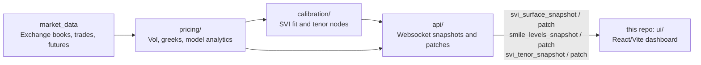

# Vol Surface

Vol Surface is the realtime browser UI for a broader options pricing and calibration system. It consumes websocket snapshots and patches from a pricing-engine API, then visualises fitted SVI variance/volatility surfaces, quoted option smiles, risk-reversal and fly nodes, tenor slices, quote-vs-fit dislocations, and fit diagnostics.

This repository contains the `ui` layer only. Backend pricing, calibration, market-data normalisation, and websocket broadcasting services are expected to live in the wider engine stack.

Although demonstrated on crypto options, the framework is designed around general pricing-system problems: constrained calibration, market data normalisation, curve/surface construction, risk generation, and trader-facing visualisation. These concepts transfer directly to rates curves, swaption surfaces, credit curves, and fixed income analytics.

## Demo Scope

The dashboard is designed to run against a live websocket API. Without that API it can still be built, linted, and previewed, but the market-data panels will not populate.

Recommended screenshots before sharing publicly:

- Surface monitor: variance/volatility term structure and fit diagnostics.
- Smile matrix: per-expiry bid/ask/trade IV with Deribit/OKX overlays.
- Risk grids: RR/fly nodes, tenor mode, and quote-through-fit heatmap.

## What It Does

- Displays live fitted SVI variance and volatility surfaces from the pricing engine.
- Shows per-expiry smile charts with Deribit/OKX bid, ask, and last-trade IV points.
- Tracks risk-reversal nodes, fly nodes, tenor rows, and RR/fly term structures.
- Highlights quotes through the fitted SVI mid in the SVI-through matrix.
- Shows fit metrics such as current fit, last fit, elapsed fit time, feed state, and SVI push time.
- Provides runtime diagnostics for websocket queue depth, dropped messages, render timing, and crash logs.
- Supports first-visit data-quality/GDPR disclosure for externally shared deployments.
- Deploys as a static Vite build, suitable for S3/CloudFront or another HTTPS-capable static host.

## Architecture



Expected wider repo layout:

```text
pricing/        Pricing models, greeks, SVI evaluation, quote analytics
calibration/    SVI calibration, RR/fly node construction, tenor interpolation
market_data/    Exchange websocket clients, book/trade normalisation
api/            Websocket API and snapshot/patch broadcaster
ui/             This React/Vite dashboard
```

Boundary of this repository:

```text
Included:     React dashboard, chart rendering, websocket ingestion, static build/deploy config
Not included: Exchange connectors, pricing models, SVI calibration jobs, persisted market data, API service
```

Current repo layout:

```text
src/App.tsx                         Main dashboard layout and panels
src/App.css                         Dashboard styling and responsive layout
src/hooks/useSviFeed.ts             Websocket ingestion and state merging
src/lib/svi-charting.ts             Chart data builders and formatting helpers
src/lib/svi-types.ts                Stream and chart TypeScript types
src/components/CanvasCharts.tsx     Canvas-based smile and variance charts
src/components/Surface3DCanvas.tsx  3D surface renderer
src/components/AppErrorBoundary.tsx Runtime crash boundary
public/derivasys.svg                Browser favicon
scripts/export-dist.sh              Copies build output into another repo
Dockerfile                          Production frontend image
nginx.conf                          Static serving and websocket proxy
docker-compose.yml                  Frontend plus API local deployment
```

## Technical Design Notes

- The UI treats websocket payloads as snapshots or patches and merges them by expiry/tenor/strike rather than replacing whole surfaces on every tick.
- Canvas rendering is used for dense, fast-moving smile and surface charts to avoid excessive DOM churn.
- Bid/ask/last-trade points are animated and aged client-side so transient market updates do not appear as hard flicker.
- Fit metrics, queue depth, dropped-message counts, render timings, and crash logs are exposed through a debug mode for operational diagnosis.
- Configuration is environment-driven via `VITE_SVI_WS_URL`; production deployments should use `wss://...` or a same-origin HTTPS websocket proxy.

## Runtime Data Contract

The UI expects the API to stream JSON websocket messages. Supported message families include:

- `svi_surface_snapshot`
- `svi_surface_patch`
- `smile_levels_snapshot`
- `smile_levels_patch`
- `smile_levels_add`
- `smile_levels_remove`
- `svi_tenor_snapshot`
- `svi_tenor_patch`
- `surface_fit_status`
- `svi_fly_patch`

The preferred surface format is schema version `1`, with per-expiry smiles, `x_axis`, `var`, `vol`, risk-reversal nodes, fly nodes, and tenor rows.

## Requirements

- Node `>=20.19.0`
- npm
- A running websocket API for the pricing engine

With `nvm`:

```bash
nvm use
```

## Run Locally

Install dependencies:

```bash
npm install
```

Start the dev server:

```bash
npm run dev
```

By default the UI connects to:

```text
ws://localhost:8765
```

Point it at another API:

```bash
VITE_SVI_WS_URL=ws://your-api-host:8765 npm run dev
```

If the UI is served over HTTPS, use `wss://...`; browsers will block insecure websocket connections from HTTPS pages.

## Build And Preview

```bash
npm run lint
npm run build
npm run preview
```

The production build is written to:

```text
dist/
```

## Docker

Docker is provided for local/containerised development. The current production-style deployment is expected to be a static build served from S3/CloudFront or another HTTPS static host.

Run the frontend and API container together locally:

```bash
docker compose up --build
```

The frontend is served at:

```text
http://localhost:8080
```

The included nginx config proxies:

```text
/ws -> api:8765
```

By default compose expects:

```text
svi-api:latest
```

Override the API image:

```bash
SVI_API_IMAGE=your-registry/your-api:tag docker compose up --build
```

Build the frontend against a direct websocket URL:

```bash
VITE_SVI_WS_URL=ws://your-api-host:8765 docker compose up --build frontend
```

## Static Deployment

For S3, CloudFront, nginx, or any static host:

```bash
VITE_SVI_WS_URL=wss://your-api.example.com/ws npm run build
```

Upload the contents of `dist/`.

Static hosting only serves the UI. The pricing API must still be reachable from the browser.

For an S3-hosted deployment:

- Serve the bucket through CloudFront or another HTTPS-capable CDN.
- Build the UI with a secure websocket URL, for example `VITE_SVI_WS_URL=wss://api.your-domain/ws`.
- If the API is currently only exposed as plain `ws://...`, put TLS in front of it first. A page loaded over `https://...` cannot connect to an insecure websocket endpoint.
- Common API TLS options are an AWS Application Load Balancer with an ACM certificate, CloudFront in front of an HTTP websocket origin, or nginx/Caddy on the EC2 instance with a Let's Encrypt certificate.

## Export Into Another Repo

If a separate pricing-engine repo serves the dashboard from `frontend/dist`, run:

```bash
npm run build:export -- /absolute/path/to/pricing-engine/frontend
```

Or:

```bash
TARGET_FRONTEND_DIR=/absolute/path/to/pricing-engine/frontend npm run build:export
```

## Debugging

Enable runtime diagnostics in the browser console:

```js
localStorage.setItem("SVI_DEBUG", "1")
location.reload()
```

This enables:

- `[svi-debug] feed` console samples every 5 seconds.
- `window.__SVI_DEBUG__` for websocket queue, dropped message, flush timing, and tracked expiry metrics.
- `window.__SVI_RENDER_DEBUG__` for canvas frame timing.
- An on-page debug overlay with queue, heap, chart count, and render timing.

Disable diagnostics:

```js
localStorage.removeItem("SVI_DEBUG")
location.reload()
```

Inspect captured runtime crashes:

```js
JSON.parse(localStorage.getItem("SVI_CRASH_LOG") || "[]")
```

## Data And Compliance Notes

This dashboard is for monitoring and operational use. Streamed market data, fitted values, and analytics may be delayed, stale, incomplete, interpolated, extrapolated, or otherwise inaccurate. It is not trading advice and should not be treated as a source of record.

The first-visit modal includes data quality and GDPR wording. Keep it enabled if the UI is exposed outside local development.

## Repository Hygiene

- Do not commit `.env`, credentials, API keys, certificates, notebooks, or local dumps.
- Keep ad-hoc experiments outside this repo or under an ignored scratch directory.
- Keep scripts intentional and documented. The only tracked shell script is `scripts/export-dist.sh`.
- Configuration should come from environment variables such as `VITE_SVI_WS_URL`, not hardcoded hosts or secrets.
