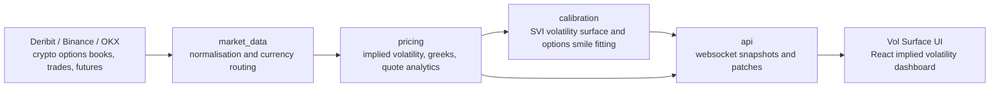

# Architecture

Vol Surface is the UI layer for a real-time crypto options volatility surface analytics platform. It is designed to display an SVI volatility surface, implied volatility term structures, options smile charts, risk reversal nodes, and quote-through-fit diagnostics from a wider pricing and calibration stack.

The dashboard receives real-time market data through websocket ingestion. The expected upstream stack normalises Deribit, Binance, OKX, and other exchange feeds, builds crypto options books and trades, fits SVI parameters, and broadcasts compact snapshots and patches to the browser.

## System Flow

## Runtime Responsibilities

- `market_data`: connects to Deribit, Binance, OKX, and similar venues, then normalises real-time market data into consistent crypto options books, trades, futures, and currency metadata.
- `pricing`: converts exchange quotes into implied volatility, greeks, theoretical values, and quote analytics for each currency, expiry, strike, and option side.
- `calibration`: fits the SVI volatility surface, builds per-expiry options smile curves, and calculates risk reversal and fly nodes.
- `api`: publishes websocket snapshots and patches for real-time market data, implied volatility points, options smile state, SVI surface state, risk reversal nodes, and fit diagnostics.
- `ui`: merges websocket ingestion updates in the browser and renders the crypto options SVI volatility surface analytics workflow.

## Browser Data Model

The UI treats incoming websocket messages as either full snapshots or incremental patches. It merges updates by currency, expiry, tenor, strike, and exchange so high-frequency implied volatility changes do not require replacing the entire SVI volatility surface.

Primary data families:

- `svi_surface_snapshot` and `svi_surface_patch` for fitted SVI volatility surface state.
- `smile_levels_snapshot`, `smile_levels_patch`, `smile_levels_add`, and `smile_levels_remove` for options smile and implied volatility quote updates.
- `svi_tenor_snapshot` and `svi_tenor_patch` for tenor views and term structure rows.
- `surface_fit_status` for calibration timing, current fit health, last fit health, and operational diagnostics.
- `svi_fly_patch` for fly and risk reversal analytics.

## Currency Routing

Currency support is feed-driven. The API can publish `available_ccys`, and the UI sends a `select_currency` websocket message when the user switches between BTC, ETH, SOL, XRP, BNB, DOGE, ADA, AVAX, LTC, or any other supported crypto options underlying.

## Deployment Shape

The frontend is a static Vite build. It can be served from S3, CloudFront, nginx, or another HTTPS-capable static host, while the pricing API remains a separate websocket service. HTTPS deployments should use `wss://` or a same-origin HTTPS websocket proxy so browser security rules allow real-time market data ingestion.
